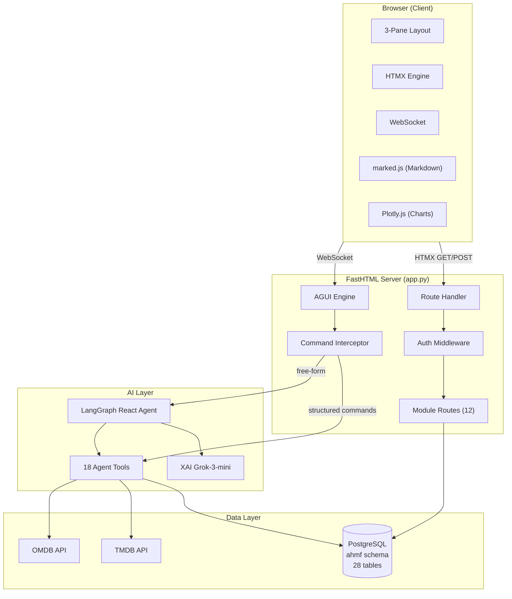
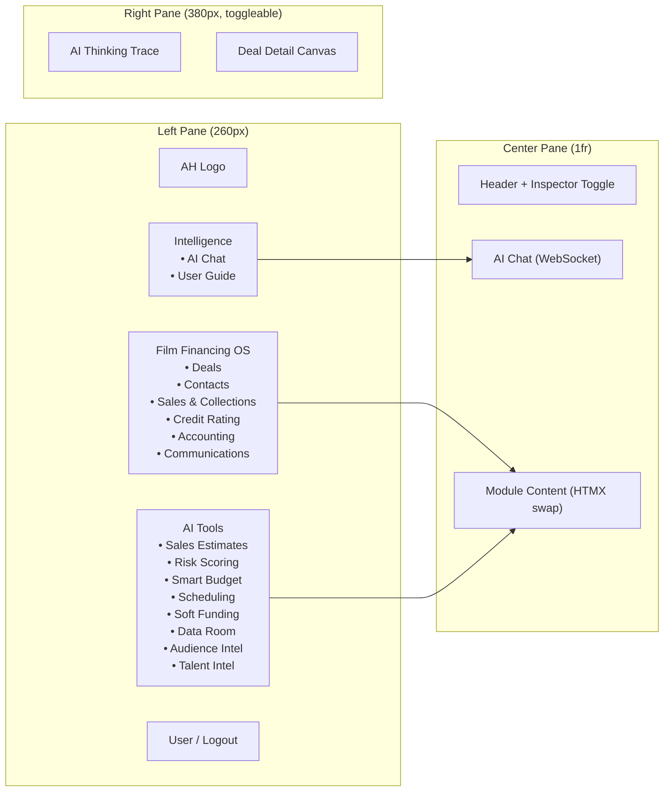
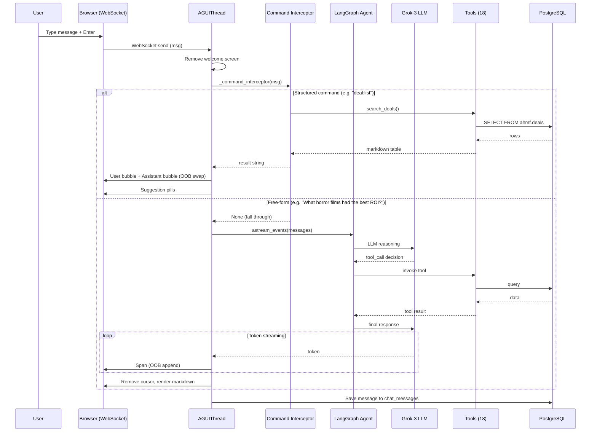
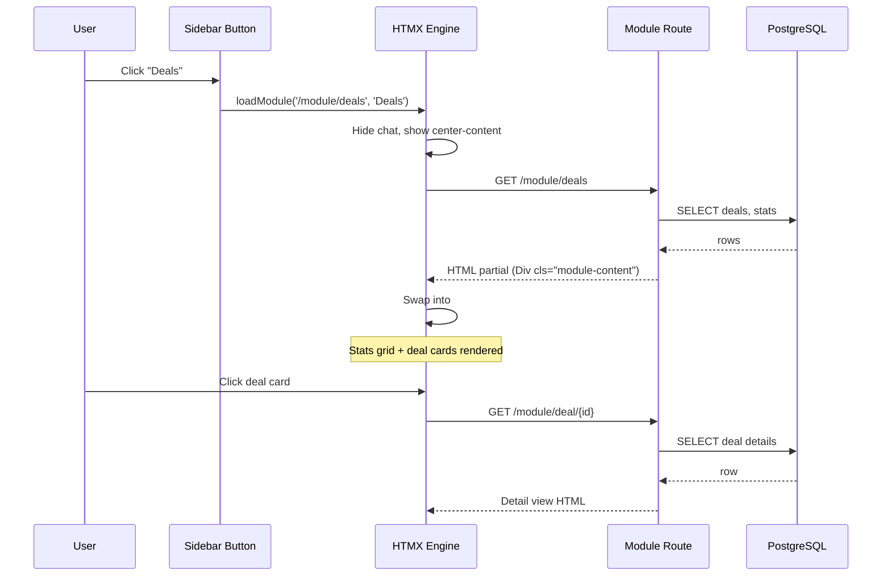
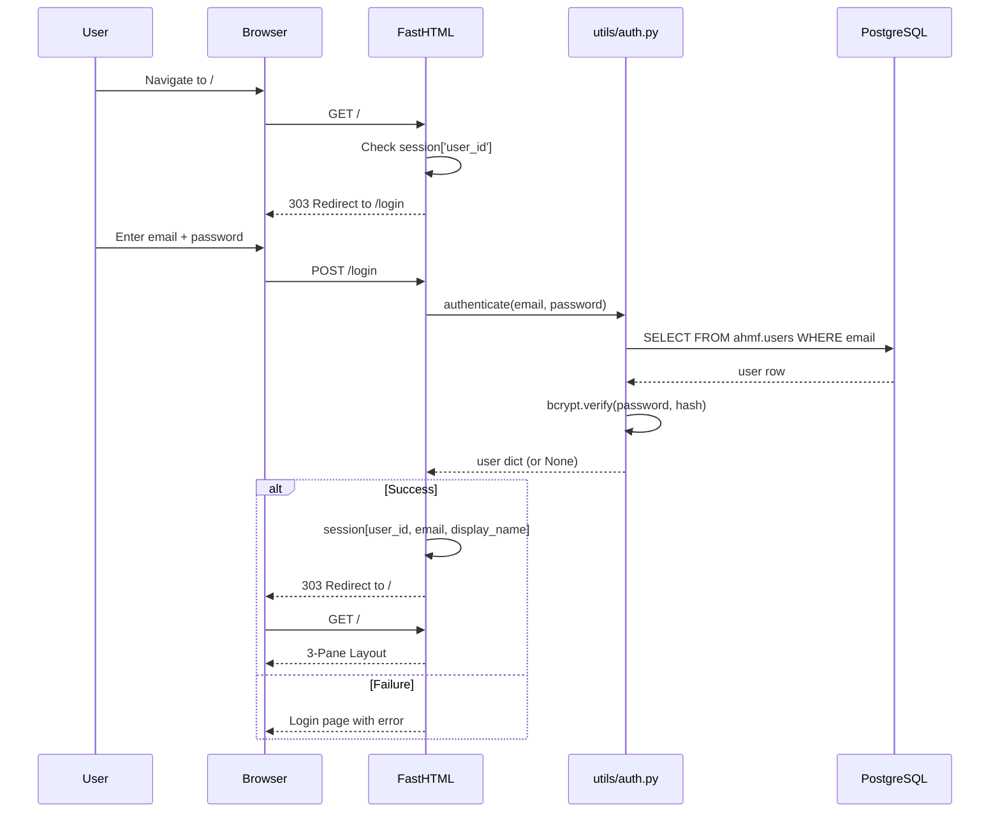
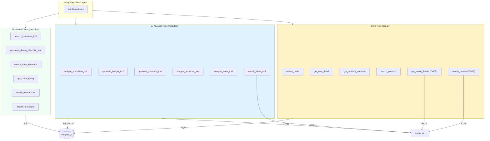
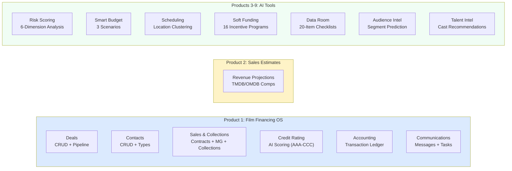
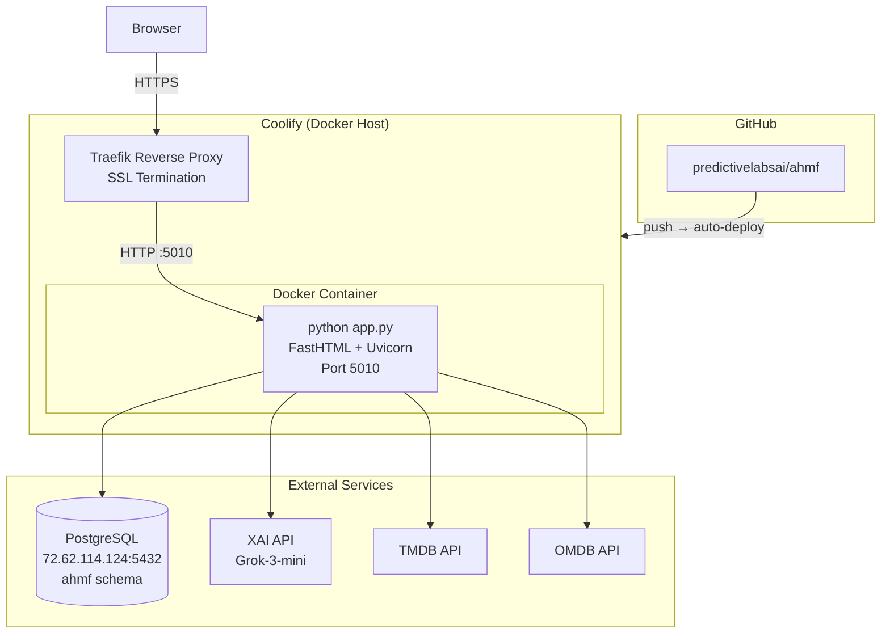

# AHMF Architecture

## System Overview



---

## 3-Pane Layout



---

## Chat Message Flow



---

## Module View Flow



---

## Authentication Flow



---

## Agent Tools Architecture



---

## Database Schema

```mermaid
erDiagram
    users ||--o{ deals : creates
    users ||--o{ contacts : creates
    users ||--o{ chat_conversations : owns

    deals ||--o{ deal_documents : has
    deals ||--o{ deal_approvals : has
    deals ||--o{ deal_balances : has
    deals ||--o{ sales_contracts : has
    deals ||--o{ transactions : has
    deals ||--o{ messages : about
    deals ||--o{ closing_checklists : has

    contacts ||--o{ deal_contacts : linked
    contacts ||--o{ credit_ratings : rated
    contacts ||--o{ contact_activities : logs

    sales_contracts ||--o{ collections : tracks
    closing_checklists ||--o{ checklist_items : contains
    budgets ||--o{ budget_items : contains
    schedules ||--o{ schedule_days : contains

    chat_conversations ||--o{ chat_messages : contains

    users {
        uuid user_id PK
        string email
        string password_hash
        string display_name
        string role
    }

    deals {
        uuid deal_id PK
        string title
        string genre
        string status
        numeric loan_amount
        numeric budget
        string borrower_name
        string producer
        string director
    }

    contacts {
        uuid contact_id PK
        string name
        string company
        string contact_type
        string email
    }

    sales_contracts {
        uuid contract_id PK
        uuid deal_id FK
        string territory
        uuid distributor_id FK
        numeric mg_amount
        string status
    }

    collections {
        uuid collection_id PK
        uuid contract_id FK
        numeric amount_due
        numeric amount_received
        date due_date
        string status
    }

    credit_ratings {
        uuid rating_id PK
        uuid contact_id FK
        numeric score
        numeric payment_reliability
        string risk_tier
        jsonb factors
    }

    transactions {
        uuid txn_id PK
        uuid deal_id FK
        string txn_type
        numeric amount
        string currency
        uuid counterparty_id FK
    }

    messages {
        uuid message_id PK
        uuid deal_id FK
        string subject
        string message_type
        string status
        date due_date
    }

    risk_assessments {
        uuid assessment_id PK
        string title
        jsonb scores
        numeric overall_score
        string risk_tier
    }

    budgets {
        uuid budget_id PK
        string title
        string scenario
        numeric total_amount
        jsonb breakdown
    }

    schedules {
        uuid schedule_id PK
        string title
        integer total_days
    }

    incentive_programs {
        uuid program_id PK
        string name
        string country
        numeric rebate_percent
    }

    audience_reports {
        uuid report_id PK
        string title
        jsonb segments
        jsonb marketing_plan
    }

    talent_reports {
        uuid report_id PK
        string title
        jsonb recommendations
        jsonb package_sims
    }
```



---

## Product Modules



---

## Deployment Architecture



---

## File Structure

```
ahmf/
├── app.py                    # Main FastHTML app (routes, agent, layout)
├── CLAUDE.md                 # Project documentation
├── Dockerfile                # Multi-stage Docker build
├── docker-compose.yml        # Coolify deployment config
├── requirements.txt          # Python dependencies
├── .env                      # Environment variables (gitignored)
│
├── modules/                  # Product module routes
│   ├── sales.py              # Sales & Collections
│   ├── credit.py             # Credit Rating (AI scoring)
│   ├── accounting.py         # Transaction ledger
│   ├── comms.py              # Messages & tasks
│   ├── risk.py               # Production Risk Scoring
│   ├── budget.py             # Smart Budgeting
│   ├── schedule.py           # Production Scheduling
│   ├── funding.py            # Soft Funding Discovery
│   ├── dataroom.py           # Deal Closing & Data Room
│   ├── audience.py           # Audience Intelligence
│   ├── talent.py             # Talent Intelligence
│   └── guide.py              # In-app User Guide
│
├── utils/
│   ├── db.py                 # SQLAlchemy pool (singleton)
│   ├── auth.py               # bcrypt + JWT auth
│   ├── tmdb_util.py          # TMDB API client
│   ├── omdb_util.py          # OMDB API client
│   ├── pdf_extractor.py      # PDF script extraction
│   └── agui/                 # AG-UI chat engine
│       ├── core.py           # WebSocket streaming, LangGraph
│       ├── styles.py         # Chat CSS
│       └── chat_store.py     # Chat persistence
│
├── sql/                      # Database migrations (01-13)
├── config/settings.py        # Constants and configuration
├── tests/
│   ├── test_suite.py         # 30 automated tests
│   └── capture_guide.py      # Playwright screenshot capture
├── static/guide/             # User guide screenshots
└── docs/
    ├── architecture_readme.md        # This file
    ├── AHMF_Platform_Overview.md     # Presentation (markdown)
    ├── AHMF_Platform_Overview.pptx   # Presentation (PowerPoint)
    └── generate_pptx.py             # PPTX generator script
```
